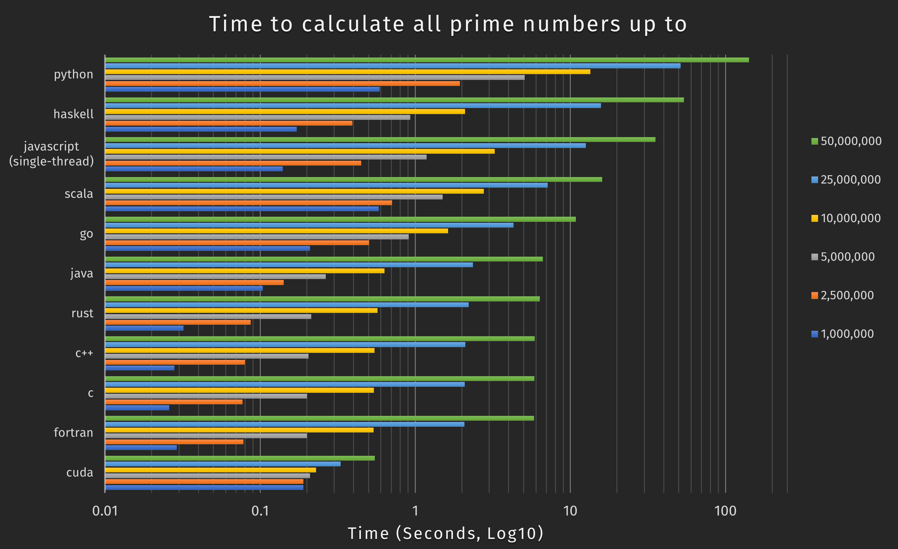

# prime-suite
This shows an implementation of a prime number calculator written in many different languages to demonstrate how the same program compares when written different languages, as well as showing roughly how performant each language can be.

### Results


---

|   	                      | 1,000,000   | 2,500,000   |	5,000,000   |	10,000,000  | 25,000,000  |	50,000,000  |
| ------------------------- | ----------- | ----------- | ----------- | ----------- | ----------- | ----------- |
| cuda	                    | 0.19        | 0.19        | 0.21        | **0.23**    | **0.33**    | **0.55**    |
| fortran	                  | 0.029       | 0.078       |	**0.201**   |	0.538       |	2.073       |	5.825       |
| c	                        | **0.026**   | **0.077**   |	**0.201**   |	0.541       |	2.089       |	5.856       |
| c++	                      | 0.028       | 0.08        |	0.205       | 0.547       | 2.102       |	5.888       |
| rust	                    | 0.032       | 0.087       |	0.214       |	0.571       |	2.213       |	6.362       |
| java	                    | 0.104       | 0.142       |	0.265       |	0.634       |	2.358       |	6.651       |
| go	                      | 0.21        | 0.505       |	0.909       |	1.631       |	4.305       |	10.859      |
| scala	                    | 0.582       | 0.709       |	1.504       |	2.769       |	7.15        |	16.048      |
| javascript (single-thread)| 0.14        | 0.449       |	1.182       |	3.248       |	12.597      |	35.41       |
| haskell	                  | 0.172       | 0.393       |	0.928       |	2.091       |	15.79       |	53.871      |
| python	                  | 0.589       | 1.945       |	5.08        |	13.48       |	51.34       |	142.172     |

#### How to use
 - Install all of the prerequisites: `gfortran gcc g++ default-jdk go gnat haskell-platform nodejs python3 ruby-full`, [kotlin](https://kotlinlang.org/docs/tutorials/command-line.html), [gradle](https://gradle.org/install/), [scala](https://www.scala-sbt.org/1.x/docs/Installing-sbt-on-Linux.html) and [rustup](https://rustup.rs/)
   - You could use the commands from [actions script](https://github.com/badcf00d/prime-suite/blob/master/.github/workflows/test_build.yml) to install these.
 - `make` runs the default `all` recipe which compiles all of the source files.
   - If you want to just make one of the languages do `make` and then the language e.g. `make fortran`
 - The programs take a numerical argument e.g. `c-prime 100` or `python3 prime.py 100` which will produce all the primes up to 100 (inclusive).
   - The only slight exception is Haskell where you need some additional arguments to enable multithreading e.g. `haskell-prime 100 +RTS -N<number of threads>`
 - `make test` runs all of the programs to produce primes up to 1,000,000.
 - `make clean` deletes all of the files created by the build process.

#### Source Contents
```
├── Makefile                            # Makefile for GNU Make
├── prime.adb                           # Ada source file
├── prime.c                             # C source file
├── prime.cpp                           # C++ source file
├── prime.f90                           # Fortran source file
├── prime.go                            # Go source file
├── prime.hs                            # Haskell source file
├── prime.java                          # Java source file
├── prime.js                            # JavaScript source file
├── prime.py                            # Python 3 source file
├── prime.rb                            # Ruby source file
├── kotlin-native-prime
│   ├── src
│   │   └── commonMain
│   │       └── kotlin
│   │           └── prime.kt            # Kotlin source file
├── rust-prime
│   ├── src
│   │   └── bin
│   │       └── prime.rs                # Rust source file
├── cuda
│   ├── prime
│   │   └── prime.cu                    # Cuda source file
└── scala-prime
    └── src
        └── main
            └── scala
                └── prime.scala         # Scala source file
```
---

#### Multi-threading

 🗙 **Ada** - Does support creating task functions that may be run as a thread, but does not have support for doing highly parallel iteration in a concise way.

 🗙 **JavaScript** - Can spawn child processes through the `worker_threads` API, but does not have any sort of multi-threading support within a program.

 🗙 **Kotlin Native** - The kotlinx-coroutines-core-native library supports multi-threading (see issue https://github.com/Kotlin/kotlinx.coroutines/issues/462), although currently it does not seem to utilize all cores.

 ✓ **C** - Supports OpenMP through `#pragma omp`.

 ✓ **C++** - Supports OpenMP through `#pragma omp`.

 ✓ **Fortran** - Supports OpenMP through `!$omp`.

 ✓ **Go** - Goroutines combined with WaitGroups are a reasonably consise way of making a parallel section of code.

 ✓ **Java** - The IntStream class provides the `parallel().forEach()` method which is a multi-threaded iterator.

 ✓ **Haskell** - The `parallel` package provides multi-threaded list strategies.

 ✓ **Python** - Supports multi-threading with `ThreadPoolExecutor` from concurrent.futures, and multi-processing from `multiprocessing`. The multi-processing approach was significantly faster in this example so that is what's used here.

 ✓ **Rust** - The Rayon library adds supports for the `par_iter_mut().enumerate().for_each()` method which provides a multi-threaded iterator.

 ✓ **Scala** - The `scala.collection.parallel.CollectionConverters` library provides a parallel iterator `par.foreach`.

 ✓ **Ruby** - The `parallel` module for ruby adds various parallel iterators that can provide parallel multi-processing or concurrent (but not parallel) multi-threading.

 ✓ **Cuda** - GPUs are by nature massively multi-threaded